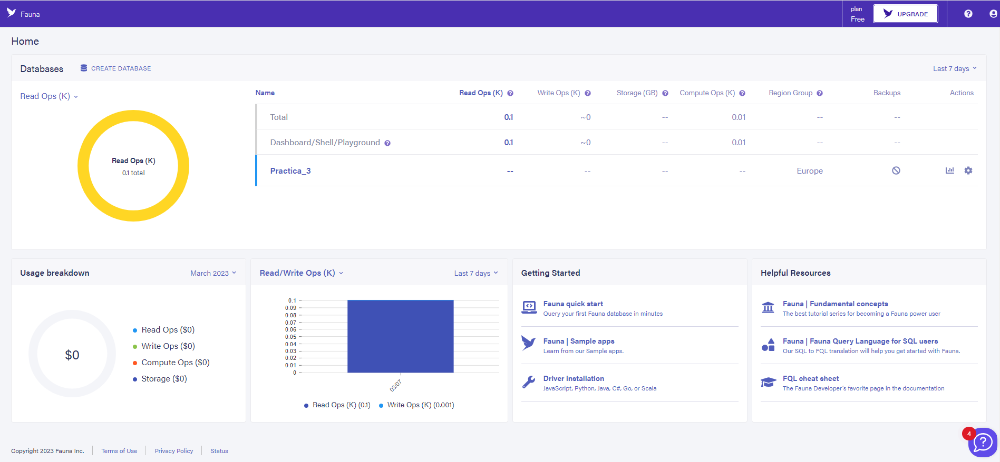
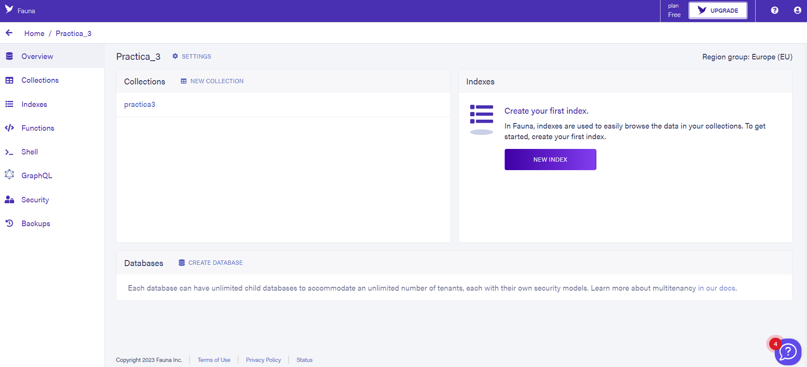
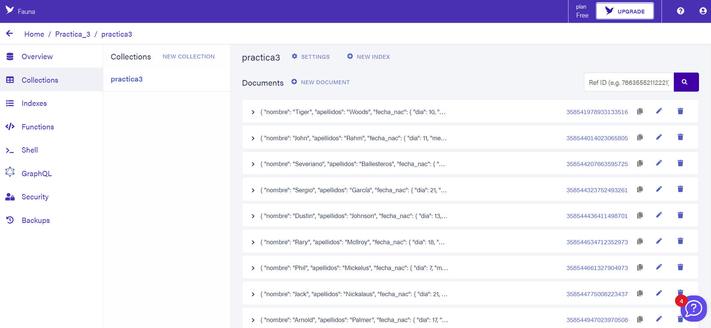
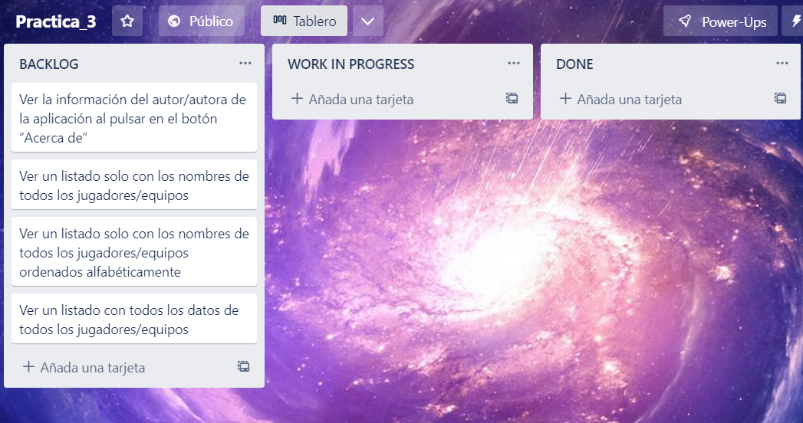
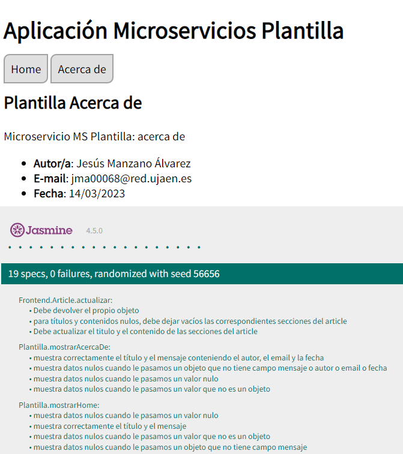
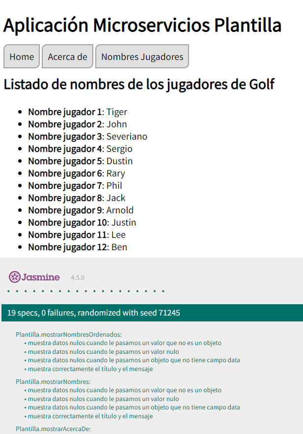
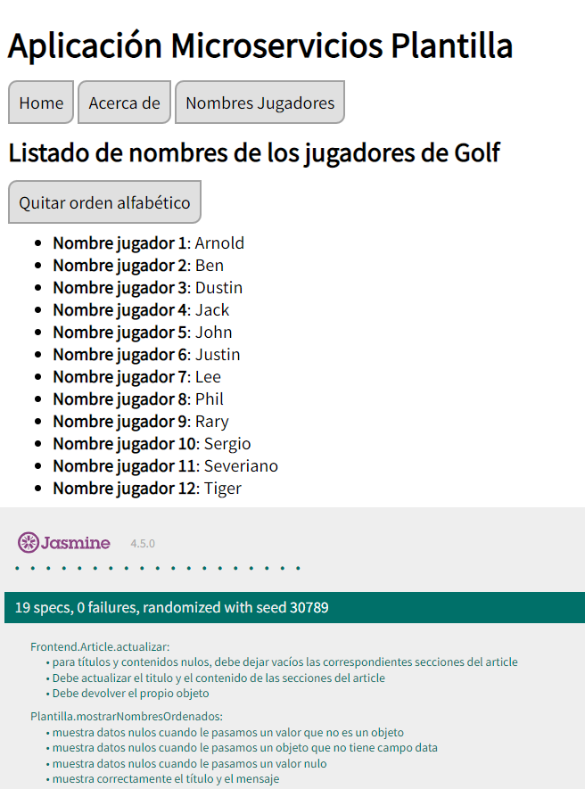
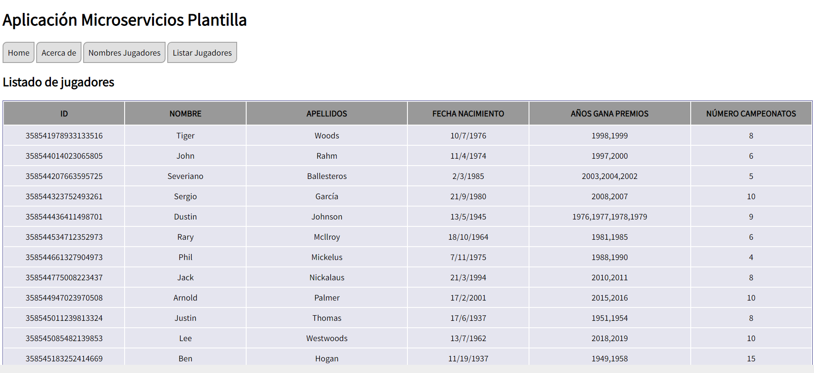
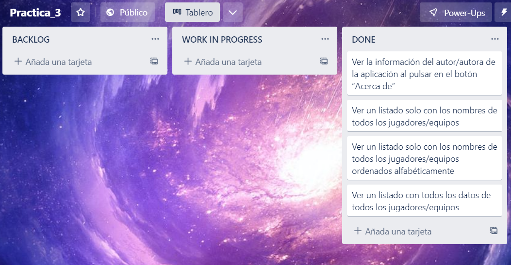

# Práctica 3

## Introducción del proyecto

Captura de pantalla del home de Fauna:

Captura de pantalla de la base de datos de Fauna:

Captura de pantalla de la colección creada en Fauna:

### Realizado por Jesús Manzano Álvarez
Estudiante de Informática de la Universidad de Jaén, de la asignatura Desarrollo Ágil.
* **Correo**: jma00068@red.ujaen.es
* **GitHub**: https://github.com/jma00068/
* **Trello**: https://trello.com/jesusmanzanoalvarez

## Iteración 1

En primer lugar hay que escoger las HU que queremos implementar y describirlas en trello. La situación inicial justo antes de comenzar el desarrollo es la siguiente:

En esta primera iteración he implementado las siguiente funcionalidades:

1. Ver la información del autor/autora de la aplicación al pulsar en el botón “Acerca de”.

2. Ver un listado solo con los nombres de todos los jugadores/equipos.

3. Ver un listado solo con los nombres de todos los jugadores/equipos ordenados alfabéticamente.

4. Ver un listado con todos los datos de todos los jugadores/equipos.

### Primera funcionalidad

Para esta primera funcionalidad debemos modificar las variables de autor, email y fecha de la plantilla inicial.

El resultado obtenido tras la implementación de esta funcionalidad es:

### Segunda funcionalidad

Para mostrar un listado de todos los nombres de todos los nombres de los jugadores, la idea es hacer una consulta en el backend hacia la base de datos donde me devuelva un vector con todos los nombres y luego finalmente los muestro en el front-end.

En mi caso para esta funcionalidad simplemente muestro una lista ordenada de html con todos los nombres obtenidos al consultar la API.

El resultado obtenido tras la implementación de esta funcionalidad es:

### Tercera funcionalidad

Una vez implementada la funcionalidad anterior, ahora intentaremos añadir la funcionalidad para que se muestren de forma ordenada alfabéticamente.

Para ello en mi caso he optado por una vez obtenidos todos los nombres en local al consultar el servidor (aunque estén desordenados) los ordenamos justo antes de mostrarlos.

El resultado obtenido tras la implementación de esta funcionalidad es:

### Cuarta funcionalidad

Para esta cuarta funcionalidad y última de esta primera iteración, la idea es obtener todos los campos de todos los usuarios y mostrarlos.

Para ello hacemos una consulta a la base de datos donde nos devuelva todos los datos relacionados con los jugadores y luego en el front-end gracias a lenguajes como html y css mostramos los resultados en formato de tabla de una forma mucho más clara y precisa.

El resultado obtenido tras la implementación de esta funcionalidad es:

### Finalización

Una vez que hemos implementado todas las HU descritas para esta primera iteración el aspecto del tablero de Trello es el siguiente:

