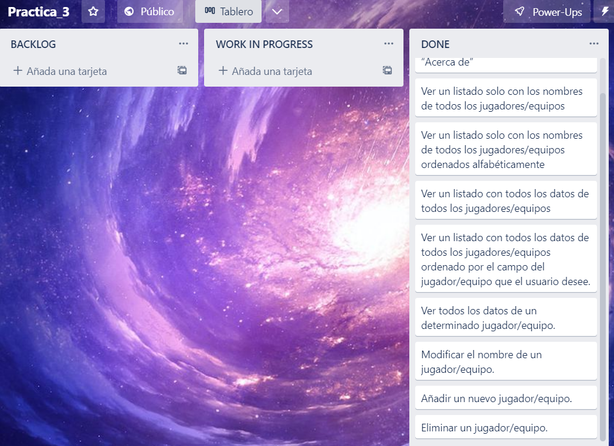

# Práctica 3

## Introducción del proyecto

Captura de pantalla del home de Fauna:

Captura de pantalla de la base de datos de Fauna:

Captura de pantalla de la colección creada en Fauna:

### Realizado por Jesús Manzano Álvarez

Estudiante de Informática de la Universidad de Jaén, de la asignatura Desarrollo Ágil.

* **Correo**: jma00068@red.ujaen.es
* **GitHub**: https://github.com/jma00068/
* **Trello**: https://trello.com/jesusmanzanoalvarez

## Iteración 1

En primer lugar hay que escoger las HU que queremos implementar y describirlas en trello. La situación inicial justo antes de comenzar el desarrollo es la siguiente:

En esta primera iteración he implementado las siguiente funcionalidades:

1. Ver la información del autor/autora de la aplicación al pulsar en el botón “Acerca de”.

2. Ver un listado solo con los nombres de todos los jugadores/equipos.

3. Ver un listado solo con los nombres de todos los jugadores/equipos ordenados alfabéticamente.

4. Ver un listado con todos los datos de todos los jugadores/equipos.

### Primera funcionalidad

Para esta primera funcionalidad debemos modificar las variables de autor, email y fecha de la plantilla inicial.

El resultado obtenido tras la implementación de esta funcionalidad es:

### Segunda funcionalidad

Para mostrar un listado de todos los nombres de todos los nombres de los jugadores, la idea es hacer una consulta en el backend hacia la base de datos donde me devuelva un vector con todos los nombres y luego finalmente los muestro en el front-end.

En mi caso para esta funcionalidad simplemente muestro una lista ordenada de html con todos los nombres obtenidos al consultar la API.

El resultado obtenido tras la implementación de esta funcionalidad es:

### Tercera funcionalidad

Una vez implementada la funcionalidad anterior, ahora intentaremos añadir la funcionalidad para que se muestren de forma ordenada alfabéticamente.

Para ello en mi caso he optado por una vez obtenidos todos los nombres en local al consultar el servidor (aunque estén desordenados) los ordenamos justo antes de mostrarlos.

El resultado obtenido tras la implementación de esta funcionalidad es:

### Cuarta funcionalidad

Para esta cuarta funcionalidad y última de esta primera iteración, la idea es obtener todos los campos de todos los usuarios y mostrarlos.

Para ello hacemos una consulta a la base de datos donde nos devuelva todos los datos relacionados con los jugadores y luego en el front-end gracias a lenguajes como html y css mostramos los resultados en formato de tabla de una forma mucho más clara y precisa.

El resultado obtenido tras la implementación de esta funcionalidad es:

### Finalización

Una vez que hemos implementado todas las HU descritas para esta primera iteración el aspecto del tablero de Trello es el siguiente:

## Iteración 2

Tal y como hemos hecho anteriormente primero hay que escoger las HU que queremos implementar y describirlas en trello. La situación inicial justo antes de comenzar el desarrollo es la siguiente:

En esta primera iteración he implementado las siguiente funcionalidades:

1. Ver un listado con todos los datos de todos los jugadores/equipos ordenado por el campo del jugador/equipo que el usuario desee.

2. Ver todos los datos de un determinado jugador/equipo.

3. Modificar el nombre de un jugador/equipo.

### Primera funcionalidad

Para esta primera funcionalidad en mi caso he modificado una de las funciones que ya existían anteirormente, que se encarga de mostrar muchos jugadores.

La diferencia es que he añadido un parámetro el cuál me permite indicar por el cuál podemos ordenar los datos y justo antes de mostrarlos se ordenan.

El resultado obtenido tras la implementación de esta funcionalidad es:

### Segunda funcionalidad

Para mostrar un jugador en concreto llamo a una función con el id del jugador el cuál se muestra en forma de formulario. Esto me permite posteriormente hacer peticiones de tipo post.

El resultado obtenido tras la implementación de esta funcionalidad es:

### Tercera funcionalidad

Una vez implementada la funcionalidad anterior, ahora intentaremos añadir la funcionalidad para que se pueda editar el nombre del jugador en concreto.

Para ello en mi caso al pulsar el botoón de editar se modifica dinamicamente el html para que aparecan los correspondientes botones de guardar/cancelar y el campo editable del nombre. Una vez editado si se pulsa el botón guardar se hará una petición post (gracias a que está en un formulario) y se guardarán dichos datos.

**Importante**: Los test de las funciones utilizadas para implementar esta funcionalidad no he conseguido hacerlos, ya que hacen llamadas al propio DOM. Intentaré añadirlos para futuras iteraciones.

El resultado obtenido tras la implementación de esta funcionalidad es:

### Finalización

Una vez que hemos implementado todas las HU descritas para esta segunda iteración el aspecto del tablero de Trello es el siguiente:

## Iteración 3

Al igual que anteriormente primero hay que escoger las HU que queremos implementar y describirlas en trello. La situación inicial justo antes de comenzar el desarrollo es la siguiente:

En esta primera iteración he implementado las siguiente funcionalidades:

1. Añadir un nuevo jugador/equipo.

2. Eliminar un jugador/equipo.

### Primera funcionalidad

Para esta primera funcionalidad en mi caso he añadido un nueva opción llamada "Añadir jugaador" en la cuál se despliega un formulario que puede ser rellenado con los datos del jugador.

Una vez indicados todos los datos pulsaremos el botón añadir, el cuál hará un petión post al backend para que se el jugador sea añadido en la base de datos.

El resultado obtenido tras la implementación de esta funcionalidad es:

### Segunda funcionalidad

Para eliminar un jugador en el apartado de mostrar un jugador he añadido un nuevo jugador que permite eliminar dicho jugador.

Para ello hace una petición post con el id del jugador y este es eliminado de la base de datos.

El resultado obtenido tras la implementación de esta funcionalidad es:

### Finalización

**Importante**: Los test creados en el backend para probar dichas funcionalidades se encuentran comentadas, ya que al modificar el número de jugadores provoca que otros test fallen. Además, algunos de los test que no fueron añadidos en la anterior iteración han sido añadidos en esta.

Una vez que hemos implementado todas las HU descritas para esta tercera iteración el aspecto del tablero de Trello es el siguiente:

